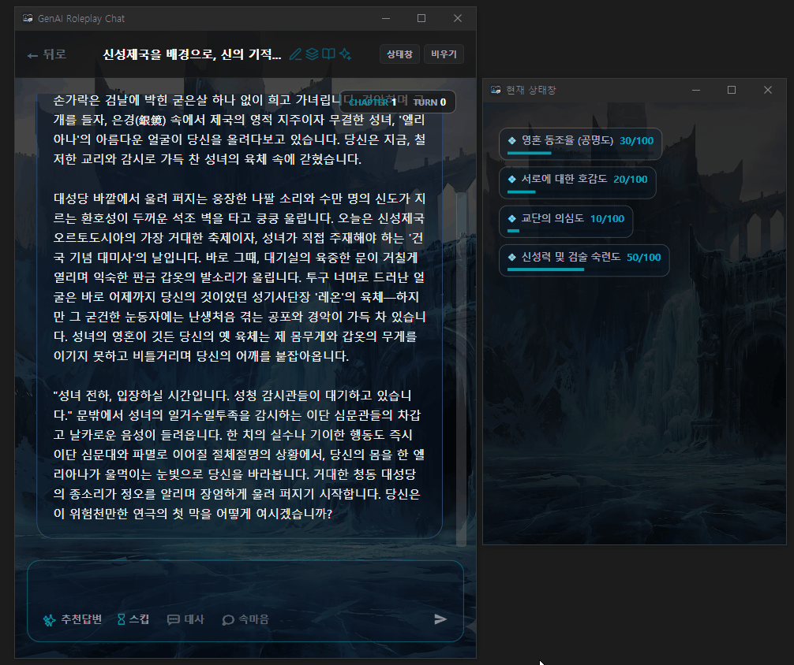

# GRC (GenAI Roleplay Chat)

[](https://dotnet.microsoft.com/download/dotnet/8.0)
[](#)
[](LICENSE)

GRC는 Google Gemini API를 활용하여 고도로 몰입감 있고 생동감 넘치는 캐릭터와 롤플레잉 및 소설 창작을 즐길 수 있는 **C# WPF 기반의 데스크톱 클라이언트**입니다.




---

## 기술 문서 (Documentation)

프로젝트 전체 아키텍처 및 상세 구현 명세는 `Obsidian.Agent` 저장소에 중앙 집중화되어 관리됩니다. 아래 문서들은 개발자와 코딩 에이전트 모두가 참조하는 **단일 진실의 원천(Single Source of Truth)**입니다.

- [00_project_overview.md](../Obsidian.Agent/GRC/docs/00_project_overview.md): GRC 프로젝트 정체성, 비전 및 계층 구조 개요
- [01_grc_architecture.md](../Obsidian.Agent/GRC/docs/01_grc_architecture.md): 3단계 메모리 파이프라인, O(1) 파일 로거, 비차단 스트리밍 및 동기화 구현 명세

---

## 🌟 핵심 기능 (Key Features)

- **3단계 메모리 파이프라인**: 단기(최근 18턴) ➔ 중기(10턴 단위 챕터 요약) ➔ 장기(1,500자 단위 연대기 압축)로 구성된 계층적 캐시로 토큰 요금을 극대화하여 절감합니다.
- **비차단(Non-blocking) 렌더링**: `System.Threading.Channels` 비동기 스트리밍 및 60FPS 배치 렌더링으로 타자가 그려질 때 메인 UI가 전혀 버벅이지 않습니다.
- **O(1) 파일 쓰기 최적화**: 무거운 전체 JSON 역직렬화 없이 바이너리 탐색(Seek)을 통해 배열 끝부분에 새 로그를 즉각 추가하는 초고속 로거를 제공합니다.
- **AI 세션 아키텍트**: 키워드 한 줄만으로 세계관 설정, 인물 사전(로어북), 스탯창 및 프롬프트를 에이전트 상태 기계를 거쳐 스스로 생성하고 자가 검수(Self-Review)합니다.
- **멀티모달 감정 TTS**: 대사를 스트리밍 중에 실시간 감지하여 성우급 감정 연기 음성을 prefetch하고 자막 싱크에 맞춰 정밀 재생합니다.


---

## 🚀 시작 가이드 (Getting Started)

### 요구 사항 (Prerequisites)
* Windows OS
* [.NET 8.0 SDK](https://dotnet.microsoft.com/download/dotnet/8.0) 이상 설치 필요

### 빌드 및 실행 (Build & Run)
명령 프롬프트 또는 PowerShell을 열고 프로젝트 루트 디렉토리에서 다음 명령을 실행합니다.

```bash
# 의존성 복구 및 빌드
dotnet build

# 애플리케이션 실행
dotnet run --project GRC/GRC.csproj
```

---

## ⚙️ 설정 가이드 (Configuration)

GRC는 **Google AI Studio**와 **Google Cloud Vertex AI** 두 가지 연동 방식을 지원합니다.

### 방법 1. Google AI Studio API 키 사용 (권장 - 가장 간편함)

> [!WARNING]
> **제약 사항**: Google AI Studio API 키만 단독으로 사용하는 경우, 성우 멀티모달 TTS(오디오 대사 낭독) 기능은 연동 문제로 인해 지원되지 않습니다. 감정 연기 TTS 기능을 완벽하게 활성화하시려면 아래의 **방법 2 (Google Cloud Vertex AI)** 연동을 권장합니다.

1. 앱을 실행한 후 우측 하단의 **설정(Settings)** 메뉴로 이동합니다.
2. 발급받은 Google AI Studio API Key를 입력창에 넣고 저장합니다.
3. 또는 프로젝트 빌드 출력 디렉토리의 `AppSettings.json` 파일에 직접 설정할 수도 있습니다:
   ```json
   {
     "ApiKey": "YOUR_GEMINI_API_KEY",
     "UseVertexAI": false
   }
   ```

### 방법 2. Google Cloud Vertex AI 사용
1. Google Cloud 콘솔에서 Vertex AI API가 활성화된 프로젝트의 **서비스 계정 키 파일(`.json`)**을 생성하여 다운로드합니다.
2. 다운로드한 JSON 파일의 이름을 `google-credentials.json`으로 변경합니다.
3. 해당 파일을 아래 경로에 위치시킵니다:
   `GRC/Config/google-credentials.json`
   *(주의: 이 파일은 `.gitignore`에 등록되어 있어 Git에 커밋되지 않습니다.)*

---

## 🤝 기여 방법 (Contributing)

버그 제보나 기능 제안은 언제나 환영합니다! 기여하고 싶으신 경우 아래 절차를 따라주세요:

1. 프로젝트를 **Fork**합니다.
2. 새로운 기능 브랜치를 생성합니다 (`git checkout -b feature/AmazingFeature`).
3. 변경 사항을 **Commit**합니다 (`git commit -m 'Add some AmazingFeature'`).
4. 브랜치에 **Push**합니다 (`git push origin feature/AmazingFeature`).
5. Pull Request를 생성하여 검토를 요청합니다.

---

## 📄 라이선스 (License)

본 프로젝트는 **MIT License** 하에 배포됩니다. 자세한 내용은 `LICENSE` 파일을 참고해 주세요.
