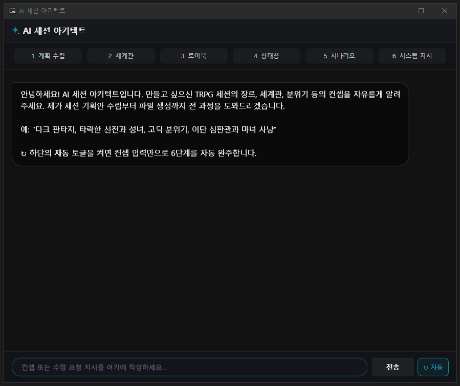
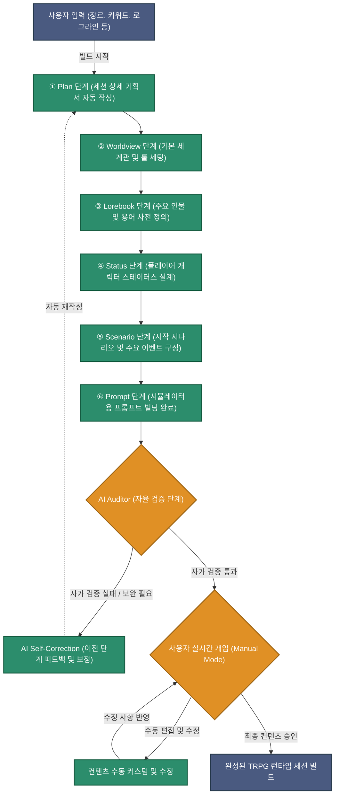
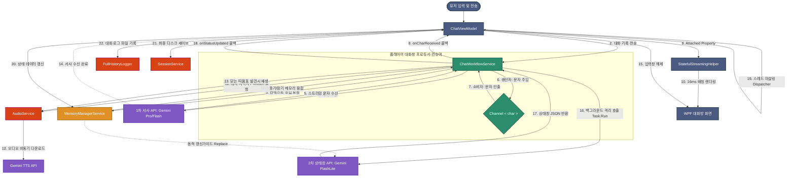

# GRC (GenAI Roleplay Chat)

[](https://dotnet.microsoft.com/download/dotnet/8.0)
[](#)
[](LICENSE)

GRC는 Google Gemini API를 활용하여 고도로 몰입감 있고 생동감 넘치는 캐릭터와 롤플레잉 및 소설 창작을 즐길 수 있는 **C# WPF 기반의 데스크톱 클라이언트**입니다.


단순히 이전 대화를 나열하여 보내는 한계를 뛰어넘어, 대규모 서사를 효율적으로 유지하기 위한 **3단계 압축 기억 메커니즘**, 지능적인 **재귀적 로어북**, 그리고 성우처럼 감정을 담아 말하는 **Gemini 멀티모달 TTS 워크플로우** 등이 탑재되어 있어 고품질의 AI 롤플레이 환경을 제공합니다.

---

## 📌 목차 (Table of Contents)

1. [핵심 기능 (Key Features)](#-핵심-기능-key-features)
2. [기술 스택 (Tech Stack)](#-기술-스택-tech-stack)
3. [시작 가이드 (Getting Started)](#-시작-가이드-getting-started)
4. [설정 가이드 (Configuration)](#-설정-가이드-configuration)
5. [프로젝트 구조 (Architecture)](#-프로젝트-구조-architecture)
6. [기여 방법 (Contributing)](#-기여-방법-contributing)
7. [라이선스 (License)](#-라이선스-license)

---

## 🌟 핵심 기능 (Key Features)

### 1. 3단계 메모리 파이프라인 (3-Tier Memory Pipeline)
긴 서사의 흐름을 잃지 않고 AI의 기억 용량 한계를 극복하기 위해 기억을 3단계로 정밀하게 압축하고 관리합니다.
* **단기 기억 (Raw History)**: 최근 주고받은 날것 상태의 대화(최대 18턴)를 원본 그대로 보존하여 즉각적인 맥락 대처가 가능하게 합니다.
* **중기 기억 (Chapter Plot)**: 단기 기억이 포화되면 오래된 8턴의 메시지를 잘라내어 **Gemini Flash** 모델을 통해 현재 챕터의 누적 줄거리(`Plot`)로 자동 요약 및 융합합니다.
* **장기 기억 (Chronicle)**: 챕터 버퍼가 큐(Queue)를 벗어나 밀려날 때, **Gemini Pro** 모델을 사용해 전체 서사 흐름에서 핵심적인 인과율과 세계관 변화(Canon Events)만을 선별하여 최대 1,500자 이내의 대과거 연대기(`Chronicle`)로 녹여냅니다.

### 2. 동적 로어북 시스템 (Dynamic Lorebook)
* **재귀적 매칭 (Recursive Triggering)**: 최근 대화 내역 및 상태창의 인물/장소 키워드를 분석하여 관련된 설정북을 프롬프트에 동적 삽입합니다. 주입된 본문의 키워드가 또 다른 설정을 꼬리 물어 활성화시키는 연쇄적인 루프 감지 기능이 포함되어 있습니다.
* **대과거 기억 추출**: 대화 도중 중요한 사건이 발생했을 때, 사용자가 수동으로 특정 메시지를 AI가 **대과거 시제(~했었다)** 형태의 영구 기억(`.json`)으로 정제하게 하여 로어북에 저장하는 기능을 제공합니다.

### 3. 멀티모달 감정 연기 TTS (Gemini Multimodal TTS)
* **감정선 반영 성우 연기**: 텍스트를 기계적으로 읽어주는 일반적인 TTS 엔진과 달리, `gemini-3.1-flash-tts-preview` 모델의 오디오 모달리티를 사용합니다. 캐릭터의 기본 성향 정보와 현재의 감정 디렉팅(지문 및 독백의 맥락)을 동봉해 전송하므로, **상황에 맞춰 감정이 살아 있는 성우급 오디오 연기**를 재생합니다.
* **일본어 자동 번역 낭독**: 일본어 낭독을 원할 경우 백그라운드에서 **Gemini Flash Lite**가 대사를 자연스러운 구어체 일본어로 즉석 번역한 뒤 일본어 성우 목소리로 낭독하게 합니다.
* **프로듀서-컨슈머 스트리밍**: 대화가 출력되는 동안 대사를 미리 비동기 추출하여 오디오 생성을 요청(Prefetch)하고, 화면의 타이핑이 완료되는 타이밍에 정확히 싱크를 맞춰 재생을 시작합니다.

### 4. 실시간 상태창 연동 & 시스템 개입 (Status & Meta Directives)
* **상태창 자동 파싱 & 백그라운드 격리**: AI의 응답 데이터 하단에 출력되는 `<status>` JSON 태그를 검출해 인벤토리, 현재 위치, 인물 상태, 사용자 정의 스탯(호감도, 타락도 등)을 UI에 실시간 바인딩합니다. 특히 상태창 갱신용 2차 API(FlashLite) 호출을 백그라운드 스레드로 완전히 격리하여 AI의 서사 출력이 끝나는 즉시 대화창 입력 잠금이 즉시 해제(0초 지연)되도록 사용성을 극대화하였습니다.
* **동적 상태창 갱신가이드 (Custom Rules)**: 세션을 시작하거나 세계관 수정창에서 유저가 "상태창 갱신 가이드(예: *리리스의 호감도는 매우 조금씩 오른다*)"를 직접 기술할 수 있으며, 이 규칙은 2차 상태창 갱신 API 프롬프트에 실시간 동적 규칙으로 주입되어 수치 밸런스를 유저 의도대로 정교하게 튜닝할 수 있습니다.
* **메타 디렉션 (System Interventions)**: 인물 관계 스탯의 수치가 한계치(최대치 또는 0)에 도달했을 때, 혹은 챕터가 전환될 때 시스템이 AI 프롬프트에 강제로 개입하여 극적인 연출이나 개연성 있는 장면 전환을 주도하도록 지시문을 비밀리에 주입합니다.

### 5. 평행세계 분기 (Branching) 및 추천 답변 프리페치
* **평행세계 분기**: 과거 대화 로그 중 특정 시점의 대화 카드를 마우스 우클릭하여 해당 순간을 기준으로 완전히 독립된 별도의 평행세계 세션 파일(`.json`)로 분기할 수 있습니다.
* **추천 선택지**: AI의 대답이 텍스트로 타이핑되는 동안, 플레이어가 취할 수 있는 3종의 다채로운 대사/행동 선택지(수용/반발/제3의 행동)를 백그라운드에서 미리 예측 생성하여 대사가 끝나는 즉시 유저에게 제시합니다.

### 6. AI 세션 아키텍트 (AI Session Architect)
사용자가 제시한 아주 짤막한 컨셉 한 줄(예: *사이버펑크 하수구 아포칼립스*)만을 바탕으로, 즉시 플레이 가능한 풍부한 분량의 TRPG 세션 기획 및 리소스를 알아서 설계하고 빌드해 주는 자율 코딩 에이전트 스타일의 빌더입니다.



#### ⚙️ 세션 아키텍트 빌드 워크플로우 (Session Architect Workflow)



* **6단계 에이전트 상태 기계 (State Machine)**: 기획 수립(Planning) ➡️ 세계관(Worldview) ➡️ 로어북(Lorebook) ➡️ 캐릭터 스탯창(Status) ➡️ 초기 오프닝 시나리오(Scenario) ➡️ AI GM 지시문(System Prompt)으로 이어지는 체계화된 빌드 단계로 진행됩니다.
* **자가 검수(Self-Review) 및 자율 자동화 루프**: **"↻ 자동"** 모드를 활성화하면, 각 단계 생성 완료 시 백그라운드에서 AI 감사관이 기획 내용 및 JSON 문법을 스스로 검증하여 승인(`pass`) 또는 수정 요구(`issues`)를 판단하며 다음 단계 전이와 최종 세션 적용까지 사람의 개입 없이 원스톱 자율 진행됩니다.
* **수동-자동 심리스(Seamless) 주행 전환**: 사용자가 수동 모드로 단계를 밟아가며 리뷰하다가도, 언제든지 자동 토글을 켜고 "승인 및 다음 단계"를 누르면 그 즉시 자율 엔진이 바통을 이어받아 남은 최종 단계들까지 일괄 자동화로 완주합니다.
* **생산자-소비자 기반 비동기 스트리밍 & UX 최적화**: LLM 스트리밍이 생성될 때 UI 멈춤을 완벽 차단하기 위해 **`System.Threading.Channels`** 버퍼와 30ms 단위 스로틀링 및 가변 지연(Adaptive Delay)을 적용했습니다. 또한, 미완성 상태의 날것(Raw)의 JSON 데이터가 노출되는 UI 지저분함을 방지하기 위해 실시간 문자 렌더링을 가리고 세련된 도트 스피너 진행바로 단순화하여 시각적 고급스러움과 성능 향상을 동시 달성했습니다.
* **가벼운 정규식 기반 마크다운 렌더러**: 윈도우 내부에 자체 제작된 `SimpleMarkdownHelper`가 다단계 제목(`##`), 볼드(`**`), 이탤릭(`*`), 인라인 코드(`` ` ``) 등을 빠른 성능으로 파싱하여 청록색 테마와 조화로운 마크다운 문서를 렌더링합니다.

---

## 🛠 기술 스택 (Tech Stack)

* **UI Framework**: Windows Presentation Foundation (WPF) / .NET 8.0
* **State & MVVM**: `CommunityToolkit.Mvvm` (Microsoft MVVM Toolkit 8.4)
* **Dependency Injection**: `Microsoft.Extensions.DependencyInjection` (DI 컨테이너)
* **Authentication**: `Google.Apis.Auth` (Vertex AI 서비스 계정 OAuth2 연동)
* **API Streaming & Buffering**: `System.Threading.Channels` (생산자-소비자 패턴 기반 비동기 채널)
* **HTTP Client Management**: `Microsoft.Extensions.Http` (HttpClientFactory 활용)
* **Media & Audio**: `System.Windows.Media.MediaPlayer` & `Google.Cloud.TextToSpeech.V1` (BGM, 타이핑 효과음 및 성우 멀티모달 TTS 제어)
* **JSON Serialization**: `System.Text.Json`

---

## 🚀 시작 가이드 (Getting Started)

### 요구 사항 (Prerequisites)
* Windows OS
* [.NET 8.0 SDK](https://dotnet.microsoft.com/download/dotnet/8.0) 이상 설치 필요

### 빌드 및 실행 (Build & Run)
명령 프롬프트 또는 PowerShell을 열고 프로젝트 루트 디렉토리에서 다음 명령을 실행합니다.

```bash
# 의존성 복구 및 빌드
dotnet build

# 애플리케이션 실행
dotnet run --project GRC/GRC.csproj
```

---

## ⚙️ 설정 가이드 (Configuration)

GRC는 **Google AI Studio**와 **Google Cloud Vertex AI** 두 가지 연동 방식을 지원합니다.

### 방법 1. Google AI Studio API 키 사용 (권장 - 가장 간편함)

> [!WARNING]
> **제약 사항**: Google AI Studio API 키만 단독으로 사용하는 경우, 성우 멀티모달 TTS(오디오 대사 낭독) 기능은 연동 문제로 인해 지원되지 않습니다. 감정 연기 TTS 기능을 완벽하게 활성화하시려면 아래의 **방법 2 (Google Cloud Vertex AI)** 연동을 권장합니다.

1. 앱을 실행한 후 우측 하단의 **설정(Settings)** 메뉴로 이동합니다.
2. 발급받은 Google AI Studio API Key를 입력창에 넣고 저장합니다.
3. 또는 프로젝트 빌드 출력 디렉토리의 `AppSettings.json` 파일에 직접 설정할 수도 있습니다:
   ```json
   {
     "ApiKey": "YOUR_GEMINI_API_KEY",
     "UseVertexAI": false
   }
   ```

### 방법 2. Google Cloud Vertex AI 사용
1. Google Cloud 콘솔에서 Vertex AI API가 활성화된 프로젝트의 **서비스 계정 키 파일(`.json`)**을 생성하여 다운로드합니다.
2. 다운로드한 JSON 파일의 이름을 `google-credentials.json`으로 변경합니다.
3. 해당 파일을 아래 경로에 위치시킵니다:
   `GRC/Config/google-credentials.json`
   *(주의: 이 파일은 `.gitignore`에 등록되어 있어 Git에 커밋되지 않습니다.)*

## ⚙️ 시스템 비동기 데이터 흐름도 (System Architecture Diagram)



---

## 📁 프로젝트 구조 (Architecture)

본 프로젝트는 의존성 주입(DI)이 적용된 **MVVM (Model-View-ViewModel)** 패턴으로 구성되어 있습니다.

```bash
GRC (Repository Root)
├─Docs/                     # 학술 논문 및 공식 가이드라인 기반 AI 프롬프트 설계 지침서 [NEW]
│  ├─AI_Prompt_Engineering_Guidelines.md # 최신 Prompt Engineering 핵심 원칙 및 실전 규칙
│  ├─AI_Prompt_AntiPatterns_Guidelines.md# 프롬프트 작성 시 피해야 할 안티패턴 정리
│  └─AI_Prompt_Workflow_Guide.md         # 증상별 프롬프트 검토 및 최적화 워크플로우 가이드
└─GRC/                      # 클라이언트 소스코드 루트 폴더
   ├─Config/                # 구글 클라우드 자격증명 및 AppSettings 설정 폴더
   ├─Helpers/               # UI 유틸리티 및 마크다운/스트리밍 렌더링 헬퍼
   │  ├─LlmJsonParser.cs           # LLM 출력에서 JSON 데이터(스탯/로어북 등)를 추출/파싱하는 유틸리티
   │  ├─SimpleMarkdownHelper.cs    # 헤더 및 굵게/기울임꼴을 텍스트블록에 렌더링하는 경량 마크다운 헬퍼 [UPDATED]
   │  ├─StatefulStreamingHelper.cs # 대화 실시간 출력을 위해 스무스 타이핑 배칭 처리를 담당하는 WPF Attached Property
   │  ├─AutoScrollHelper.cs        # 리스트 아이템 추가 시 자동으로 하단 스크롤을 제어해주는 헬퍼
   │  └─TokenLogger.cs             # Gemini API 호출당 토큰 소모량을 정밀 분석/기록하는 로거
   ├─Models/                # 데이터 구조 및 명세 정의 (Model 계층)
   │  ├─ChapterContext.cs          # 중기 플롯 줄거리 및 현재 세션 스탯 상태 데이터
   │  ├─CharacterPreset.cs         # 세계관, 로어북, 시스템 지시문, 기본 스탯 명세 구조체
   │  ├─ChatSession.cs             # 단기/중기/장기 메모리 요약 상태, 대화 진행 턴 추적용 모델
   │  └─SessionArchitectModels.cs  # AI 아키텍트의 설계 계획 및 상태 추적을 위한 전용 모델 [NEW]
   ├─Services/              # 비즈니스 로직 및 외부 API 통신 제어 (Service 계층)
   │  ├─ChatWorkflowService.cs     # 1차 서사 생성 및 2차 상태창 갱신, TTS 프리페칭을 조율하는 핵심 워크플로우 서비스
   │  ├─GeminiApiService.cs        # Gemini LLM API와의 직접적인 HTTP 통신 및 스트리밍 제어
   │  ├─GeminiTtsService.cs        # gemini-3.1-flash-tts 모델의 오디오 모달리티를 이용한 감정 연기 TTS 서비스
   │  ├─MemoryManagerService.cs    # 단기(Raw) ➡️ 중기(Chapter) ➡️ 장기(Chronicle)로 메모리를 요약 및 융합 제어
   │  ├─LorebookService.cs         # 재귀적으로 키워드를 검출하여 세력/인물 설정을 연쇄 주입하는 로어북 관리자
   │  ├─ReplySuggestionService.cs  # 유저 턴 대기 시 백그라운드에서 플레이어용 3지선다 선택지를 선제 예측/생성하는 서비스
   │  └─SessionArchitectService.cs # AI 아키텍트의 6단계 자동 설계 및 감사관 자가검수(Self-Review) 빌더 서비스 [NEW]
   ├─Themes/                # 다크/반투명 테마 및 Glow 컨트롤 공통 스타일 XAML 리소스
   ├─ViewModels/            # 뷰와 비즈니스 로직을 연결하는 뷰모델 계층 (ViewModel 계층)
   │  ├─ChatViewModel.cs           # 롤플레이 진행, 메타 개입 및 평행세계 분기 등의 유저 액션을 제어하는 메인 대화방 뷰모델
   │  ├─SessionListViewModel.cs    # 저장된 세션 파일 검색/나열 및 AI 아키텍트 창 오픈 제어
   │  └─SessionArchitectViewModel.cs # AI 세션 아키텍트 UI 상태기계 및 자동 루프 제어를 담당하는 뷰모델 [NEW]
   └─Views/                 # WPF UI 레이아웃 및 비하인드 코드 (View 계층)
      ├─ChatView.xaml              # 플레이어 대화 및 메타 개입 입력이 일어나는 메인 채팅방 화면
      ├─StatusWindow.xaml          # 백그라운드 스레드 격리로 0초 지연 갱신되는 캐릭터 상태창 모달 윈도우
      ├─SessionListView.xaml       # 로컬에 세이브된 평행세계 세션 리스트 뷰
      ├─EditLorebookWindow.xaml    # 수동 로어북 관리 및 키워드 추가/삭제 에디터
      └─SessionArchitectWindow.xaml # AI 아키텍트 6단계 시각화 상태바 및 자동 모드 토글이 위치한 윈도우 [NEW]
```

---

## 🤝 기여 방법 (Contributing)

버그 제보나 기능 제안은 언제나 환영합니다! 기여하고 싶으신 경우 아래 절차를 따라주세요:

1. 프로젝트를 **Fork**합니다.
2. 새로운 기능 브랜치를 생성합니다 (`git checkout -b feature/AmazingFeature`).
3. 변경 사항을 **Commit**합니다 (`git commit -m 'Add some AmazingFeature'`).
4. 브랜치에 **Push**합니다 (`git push origin feature/AmazingFeature`).
5. Pull Request를 생성하여 검토를 요청합니다.

---

## 📄 라이선스 (License)

본 프로젝트는 **MIT License** 하에 배포됩니다. 자세한 내용은 `LICENSE` 파일을 참고해 주세요.
